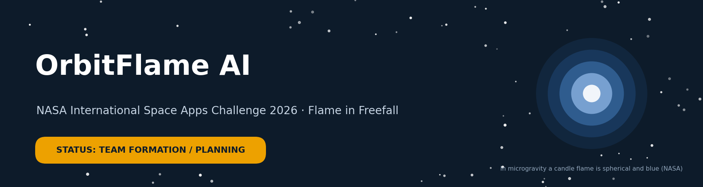
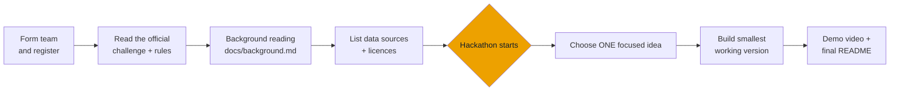

# OrbitFlame AI

> **Status: team formation / planning.** This is a team project for the **NASA International Space Apps Challenge 2026**, challenge **"Flame in Freefall: AI-Powered Fire Safety Insights from Microgravity Combustion Data"**. **No solution has been built yet.** Challenge development will happen only during the official hackathon period, following the event rules.

| | |
|---|---|
| **Event** | NASA International Space Apps Challenge 2026 |
| **Challenge** | Flame in Freefall: AI-Powered Fire Safety Insights from Microgravity Combustion Data |
| **Team** | OrbitFlame AI |
| **Team Lead** | Eman Musheer |
| **Current stage** | Team formation, registration, background reading |
| **Code** | None yet. Built during the hackathon |

---

## Why this problem matters

On a spacecraft there is nowhere to run from a fire, and flames do not behave the way they do on Earth.

- **Flames change shape without gravity.** On Earth, gravity-driven buoyant convection makes a candle flame teardrop-shaped and yellow. In microgravity, where those convective flows are absent, *"the flame is spherical, soot-free and blue"* ([NASA](https://www.nasa.gov/image-article/candle-flame-1g-vs-microgravity/)).
- **Space fire experiments already exist.** NASA's Saffire series burned material samples inside an uncrewed Cygnus cargo spacecraft after it left the International Space Station. It observed that fires in microgravity *"typically grow and burn faster on the thinner"* materials, and that higher oxygen levels produced *"more energetic flames"* ([NASA, Saffire](https://www.nasa.gov/humans-in-space/saffire-ignites-new-discoveries-in-space/)).
- **The data is public but scattered.** NASA's Physical Sciences Informatics (PSI) system stores microgravity experiment data, including combustion science: spacecraft fire safety, droplets, gaseous flames and solid fuels. It is *"accessible and open to the public"* ([NASA PSI](https://www.nasa.gov/physical-sciences-informatics-psi/physical-sciences-informatics-research-areas/)).

**Our goal:** explore AI-powered ways to make microgravity combustion and fire-safety research **easier to search, understand and visualise**, for students, researchers and mission planners.

## Questions we want to explore

These are **questions for the hackathon, not finished features**:

1. How can someone find the right experiment or dataset by asking in plain language?
2. How can results from different experiments be summarised and compared clearly?
3. What visualisations help a non-expert see how flames behave without gravity?
4. How do we show exactly where every piece of information comes from, so users can check it?

## How we are preparing



Everything **before** the orange step is preparation and learning, which the event allows. Everything **after** it happens only during the official hackathon.

## Resources we plan to review

To be confirmed against the official challenge page:

| Resource | What it is |
|---|---|
| [NASA PSI Data Repository](https://psi.nasa.gov/physci/repo/) | Public microgravity experiment data, including combustion |
| [NASA PSI on the AWS Registry of Open Data](https://registry.opendata.aws/nasa-psi/) | The same data, hosted for cloud access |
| [FLEX experiment page (NASA Glenn)](https://gipoc.grc.nasa.gov/wp/fcf-cir/flex/) | Flame Extinguishment Experiment on the ISS: inert-gas suppressants and limiting oxygen for combustion |
| [Saffire (NASA)](https://www.nasa.gov/humans-in-space/saffire-ignites-new-discoveries-in-space/) | Large-scale spacecraft fire experiments on Cygnus |
| Official Space Apps challenge resources | Linked from the challenge page |

Detailed notes, with sources, are in [`docs/background.md`](docs/background.md). Licences are tracked in [`docs/data_sources.md`](docs/data_sources.md).

## Team

| Name | Role | GitHub |
|---|---|---|
| Eman Musheer | Team Lead | [@emanmusheer2008-glitch](https://github.com/emanmusheer2008-glitch) |
| _To be added with each member's permission_ | | |

## Timeline

| Phase | Status |
|---|---|
| Team formation and registration | In progress |
| Background reading ([`docs/background.md`](docs/background.md)) | In progress |
| Read official challenge description and rules | To do |
| Hackathon: build the solution | Not started (official dates on spaceappschallenge.org) |
| Submission and demo video | Not started |

## Principles we follow

- **Honest status:** this README says what exists now. No finished features, results or awards are claimed.
- **Cite everything:** every scientific statement links to its source.
- **Respect the rules:** no solution code before the hackathon; credit all NASA and third-party data.
- **Privacy:** no API keys or personal data in the repository (`.gitignore` blocks `.env` and data files).

## Repository structure

```
orbitflame-ai/
├── README.md
├── LEARNING_GUIDE.md        # concepts to learn before the hackathon
├── assets/banner.png        # README banner
├── docs/
│   ├── background.md        # microgravity combustion notes, with sources
│   ├── planning.md          # checklists, roles, decisions
│   └── data_sources.md      # every dataset/API and its licence
├── src/                     # solution code: added DURING the hackathon
├── data/                    # small samples only (large data not committed)
└── notebooks/
```

## Disclaimer

This is an independent team project created for the NASA International Space Apps Challenge. It is **not** an official NASA product, and the team members are not NASA employees or affiliates. NASA information and data are credited to their sources.
